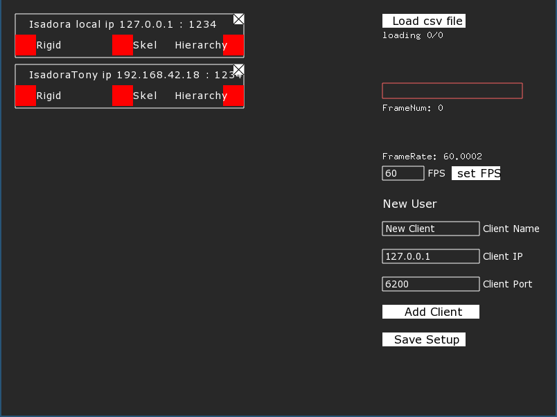
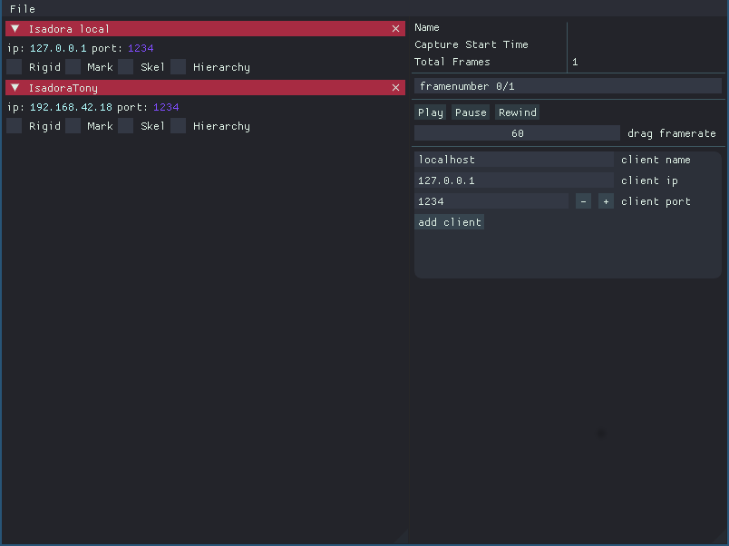

Last year we did a research into [GUI libraries](https://octo.hku.nl/octo/repository/getfile?id=J3pAKYfmdKE) for our tools. From this research we gained [Dear ImGui](https://github.com/ocornut/imgui/) to be our best contender. Therefore we have started testing integrating this library into our tools.

First thing we needed is to be able to use [Dear ImGui](https://github.com/ocornut/imgui/) in [openFrameworks](http://www.opeframeworks.cc). We could have implemented our own addon but luckily someone had already done that in the [ofxImGui](https://github.com/jvcleave/ofxImGui) addon.

[Dear ImGui](https://github.com/ocornut/imgui/) is an Immediate Mode gui library. This takes time getting used to. The general idea is to do all GUI logic as you are defining it. This means the GUI will be defined every iteration. This might feel counter intuitive at first but it has its advantages:

* the gui doensn't need to maintain state with the application as the gui is redefined every iteration
* what the gui needs to do is directly defined, no need for callbacks and sorts
* Dear ImGui does no drawing, instead it maintains a drawlist. You can draw whenever you want as is done by [ofxImGui](https://github.com/jvcleave/ofxImGui)

The hard thing about [Dear ImGui](https://github.com/ocornut/imgui/) is that it is not really documented. You'll need to figure out how it works by reading example sources and the source code of the library. You can find lots of pointers there but it's not really developer friendly that way. Best approach is just by doing and finding your way as you go. This is how we approach it.

Our first test,  besides provided examples, is to implement a new GUI for our MOCAP_CSV2OSC tool. Here's how it looks currently:


We try to mimic the current GUI using [Dear ImGui](https://github.com/ocornut/imgui/). First we define a MainMenuBar:

```
    if (ImGui::BeginMainMenuBar())
        {
            if (ImGui::BeginMenu("File"))
            {
                if (ImGui::MenuItem("Open CSV..", "Ctrl+O")) { loadAFile(); }
                if (ImGui::MenuItem("Save Setup", "Ctrl+S"))   {saveData(); }
                if (ImGui::MenuItem("Exit", "Ctrl+W"))  { ofExit(0); }
                ImGui::EndMenu();
            }
            mainmenu_height = ImGui::GetWindowSize().y;
            ImGui::EndMainMenuBar();
    }
```

we then define the clients panel as a window:

```
    ImGui::Begin("clientspanel", NULL,  ImGuiWindowFlags_NoTitleBar | ImGuiWindowFlags_NoMove | ImGuiWindowFlags_HorizontalScrollbar | ImGuiWindowFlags_NoBringToFrontOnFocus);
        // DRAW CLIENTS
        for (int i = 0; i < clients.size(); i++)
        {
            bool enabled = true;
            if ( ImGui::CollapsingHeader(clients[i]->getName().data(), &enabled, ImGuiTreeNodeFlags_DefaultOpen) )
            {
                clients[i]->draw();
            }
            if ( ! enabled )
            {
                ofNotifyEvent(clients[i]->deleteClient,i);
            }
        }
    ImGui::End();

```
In here you can see the Immediate Mode UI approach. We define a collapsing header which we provide the 'enabled' boolean. This boolean will capture whether we have clicked the close button of the collapsing header indicating we want to delete the client.

The `clients[i]->draw()` method is defined in the client class which will draw a widget for the client:
```
    void client::draw()
    {
        ImGui::Text("ip:");
        ImGui::SameLine();
        ImGui::TextColored(ImVec4(0.7f,1.0f,1.0f,1.0f), ip.data());
        ImGui::SameLine();
        ImGui::Text("port:");
        ImGui::SameLine();
        ImGui::TextColored(ImVec4(0.5f,0.3f,1.0f,1.0f), "%d", port);
        ImGui::Checkbox("Rigid", &isRigid);
        ImGui::SameLine();
        ImGui::Checkbox("Mark", &isMarker);
        ImGui::SameLine();
        ImGui::Checkbox("Skel", &isSkeleton);
        ImGui::SameLine();
        ImGui::Checkbox("Hierarchy", &deepHierarchy);
    }
```

We finally define the panel on the right. We now have a GUI looking like this:




