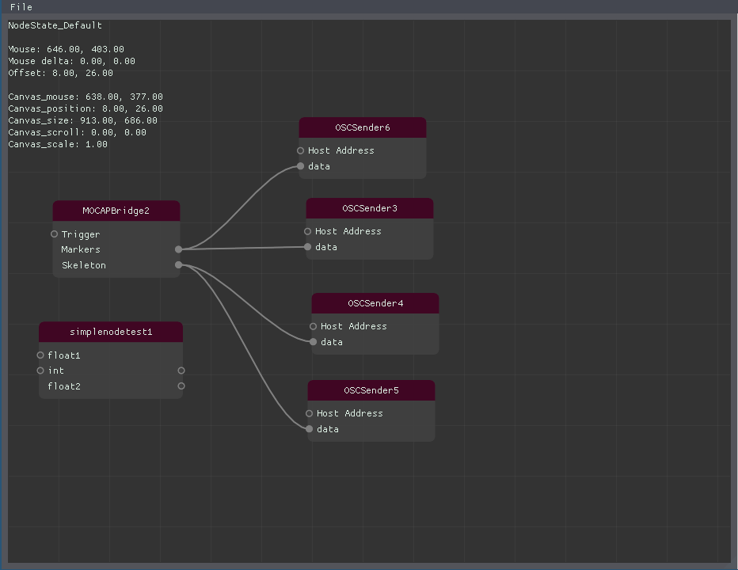

I have often wondered what would be the easiest mental model to get started programming. There's no easy answer to this one. However in recent years I have been attracted to the [Actor Model](https://wiki). It's not because I think this is the easiest model but I reckon it's closest to how we perceive our computers from the perspective of the user. As we use our computer we run a multitude of programs simultaneously while interacting with each of them. We listen to our favourite music, while the mail is being checked, surfing the web and rendering our latest video edit. The Actor Model can be regarded as little programs running simultaneously while they send messages to each other. Programming them then consists of two task:

 * 1 programming the actor
 * 2 determining a choreography for the actors

The first task is a regular programming task. The second is a newer challenge. One I regard as an interesting subject for creativity and adoption for beginning programmers for reasons stated in the introduction. I could imagine a Node Editor being a very welcoming editing tool and visualizing tool for these choreochraphies. 

We've already started experiments [building a NodeEditor UI](/blog/GuiTests/) using [Dear ImGui](https://github.com/ocornut/imgui/) and [openFrameworks](http://www.openframeworks.cc).

Continuing with this we can wonder how we could have a poor man's actor model with openFrameworks. In it's simplest form  we could just import [czmq](http://zeromq.org). However as we're not working distributed nor concurrent yet we will explore an approach using datatypes provided by [openFrameworks](http://www.opeframeworks.cc).

In [openFrameworks](http://www.opeframeworks.cc) I found the ofParameter classes. These are  mostly used to easily render GUI from parameters. However they also have options to notify of changes using an [observer pattern](https://en.wikipedia.org/wiki/Observer_pattern). We can use these to link parameters to each other like we do in a node editor. After some experiments I came up with this code which enables a simple subscribe and unsubscribe interface to ofParameter. A node in this setup can consist of multiple parameters therefore we use of ParameterGroup as a Node.

```cpp
template<typename ParamType>
struct NodeParameter : public ofAbstractParameter {
    ofParameter<ParamType> param;
    ofParameter<ParamType> &set(const std::string& name, const ParamType & value, const ParamType & min, const ParamType & max){
        return param.set(name, value, min, max);
    }
    ofParameter<ParamType> &set(const std::string& name, const ParamType & value){
        return param.set(name, value);
    }
    std::map<std::string, ofEventListener*> listeners;
    std::string getName() const { return param.getName();}
    void setName(const std::string& name ) { param.setName(name); }
    std::string toString() const { return param.toString(); }
    void fromString(const std::string& str) { return param.fromString(str);}
    std::string valueType() const { return param.valueType(); };
    void setParent(ofParameterGroup &_parent) { param.setParent(_parent);}
    bool isSerializable() const { return param.isSerializable();}
    bool isReadOnly() const { return param.isReadOnly();}
    std::shared_ptr<ofAbstractParameter> newReference() const { return param.newReference();} //TODO
    const ofParameterGroup getFirstParent() const { return param.getFirstParent();}
    void setSerializable(bool serializable) { param.setSerializable(serializable);}
    const void* getInternalObject() const { return param.getInternalObject();}

    ofEventListener* subscribe(ofParameterGroup& node, ofAbstractParameter& tgtparam) {
        if ( node.contains( this->getName() ) )
        {
            ofLogError() << "source and sink parameter are from the same node!";
            return (ofEventListener*)NULL;
        }
        if ( ! node.contains( tgtparam.getName() ) )
        {
            ofLogError() << "sink parameter " << tgtparam.getName() << " is not from node " << node.getName();
            return (ofEventListener*)NULL;
        }

        ofEventListener* ev = new ofEventListener();
        //references will except bad_cast if dyn cast fails
        try
        {
            NodeParameter<float>& paramFlt = dynamic_cast<NodeParameter<float>&>(tgtparam);
            *ev = param.newListener([&paramFlt](const ParamType &v){ paramFlt.param.set(v); });
            listeners.insert(std::pair<std::string, ofEventListener*>(node.getName() + ":" + tgtparam.getName(), ev));
            return ev;
        }
        catch ( const std::bad_cast& e ) {}

        try
        {
            NodeParameter<int>& paramInt = dynamic_cast<NodeParameter<int>&>(tgtparam);
            *ev = param.newListener([&paramInt](const ParamType &v){ paramInt.param.set(v); });
            listeners.insert(std::pair<std::string, ofEventListener*>(node.getName() + ":" + tgtparam.getName(), ev));
            return ev;
        }
        catch ( const std::bad_cast& e ) {}
        
        return ev;
    }

    bool unsubscribe(ofParameterGroup& node, ofAbstractParameter& tgtparam) {
        return unsubscribe(node.getName() + ":" + tgtparam.getName());
    }
    bool unsubscribe(ofParameterGroup& node, std::string tgtname) {
        return unsubscribe(node.getName() + ":" + tgtname);
    }

    bool unsubscribe(std::string paramid) {
        std::map<std::string, ofEventListener*>::iterator it = listeners.find(paramid);
        if ( it != listeners.end() )
        {
            delete it->second;
            listeners.erase(it);
            return true;
        }
        return false;
    }
};
```
To use this we need to declare nodes as follows:
```cpp
ofParameterGroup node1;
ofParameterGroup node2;
```
We declare parameters as follows:
```cpp
NodeParameter<int> paramEx1Node1;
NodeParameter<int> paramEx2Node1;
NodeParameter<int> paramLogNode2;
```
We initialiase everything and assing the parameters to the nodes:
```cpp
paramEx1Node1.param.set("Ex1", 0);
paramEx2Node1.param.set("Ex2", 0);
paramLog.param.set("Log", 0);
Node1.setName("Node1");
Node2.setName("Node2");
Node1.add(paramEx1Node1);
Node1.add(paramEx2Node1);
Node2.add(paramLogNode2);
```
Now we can subscribe parameters from nodes to parameter from other nodes
```cpp
paramEx1Node1.subscribe(Node2, paramLogNode2);
```
*We can see in the implementation of the `subscribe` method that subscribing to parameters from the same node will display a run-time error. For example `paramEx1Node1.subscribe(Node1, paramEx2Node1)` will display an error.
*

We have now subscribed the paramEx1Node1 parameter from Node1 to paramLog from Node2. If we now issue:
```cpp
paramEx1Node1.param++;
```
paramLog will be notified.

However we will not notice this. The only way to notice this is to use a debugger.

To create a more complete actor model we'll need an Node class which can process something as soon as it is notified. It is trivial to change the lambda in the `subscribe` method to also issue a process method, i.e.:
```
*ev = param.newListener([&paramInt, &node](const ParamType &v){ paramInt.param.set(v); node.process() });
```
An Actor instance would just need to implement the `process` method. However many design questions will come up now. What do we do when a Node has multiple parameters? Do we then run the process method for every changed parameter? How would one wait for all parameters to change before running the process method? Etc.

We also can see in the implementation of the `subscribe` method that this method will become very verbose as we need to define a test (try ... catch) for every type (i.e. int, float, string, ofColor, ... ) we can imagine to be used. This is always needed in statically typed languaged like c++. At least I don't know of any other approach into [runtime type determination](https://en.wikipedia.org/wiki/Run-time_type_information).

We now have a very basic system which lets us setup a nodal network of interconnected parameters. It's also clear we need to do more designing for convenience, code usability and performance. This setup we tested can be easily used to visualise using the NodeEditor we have [already tested](/blog/GuiTests/).

# References:
* [Another node editor for OF](https://github.com/PlaymodesStudio/ofxOceanode)
* [ofParameter discussion](https://forum.openframeworks.cc/t/ofparametergroup-and-custom-inherited-ofparameter-class/30237/14)
* [CZMQ's zactor](http://czmq.zeromq.org/manual:zactor)
* [tiny actor run-time](https://github.com/organix/tart/)